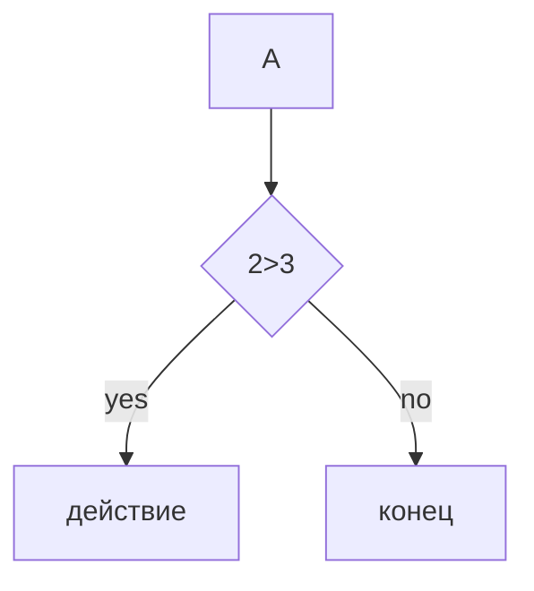

# git2_16.09

# Заголовок

выдел
-----
*курсив*
**жирный**
~pfxxx~
~~njklfdslkfd~~
'моно код'

 - гугу
 - 
 - кики
   
   - бебе
     
  1.пара

  - [x] 1

  - [ ] 2

  - [x] 3

# Ссылки

[текст] (http://youtube.com)

[Подсказка](http://youtube.com "Пёсики")

<http://youtube.com>


](https://png.pngtree.com/thumb_back/fh260/background/20230610/pngtree-picture-of-a-blue-bird-on-a-black-background-image_2937385.jpg)


# Цитата

>цитата
>
>много строк
>>ssssss

# Код

```markdown
print("hi")
```
# Таблица

---: = ориентация справа
:---: ориентация по центру
:--- = ориентация слева
| y | t | y |
|-----:|:---:|:-----|
|sdms|wffwdf|wefw |

# Экранирование

\#kss

# Диаграмма


# Заголовки

- [заголовки](#1-заголовки)
- [списки](#2-списки)
  
  
